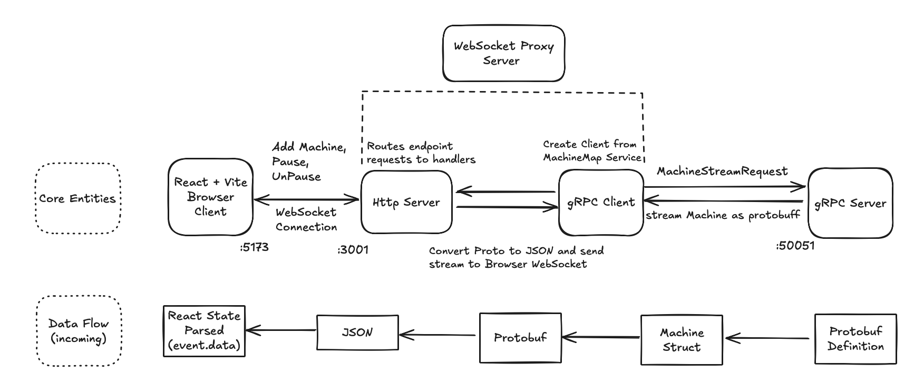
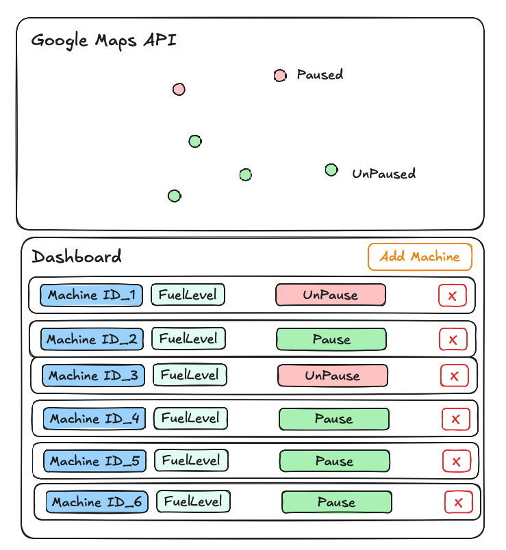
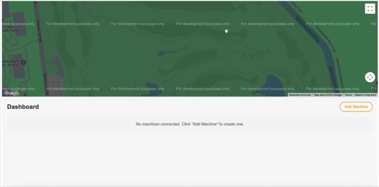

# Machine Map Monitor

A real-time monitoring application for tracking machines with gRPC streams, WebSockets, and Google Maps integration.

## Architecture

The application consists of three main components:

1. **gRPC Server**: Written in Go, manages machines and their state using Brownian motion simulation
2. **WebSocket Proxy**: Go server that bridges between gRPC streams and WebSockets for browser communication
3. **Frontend**: React application with Google Maps integration for visualizing and controlling machines



## Features

- Real-time tracking of machine positions on Google Maps
- Control panel for managing multiple machines
- Pause/resume machine movement functionality
- Fuel level monitoring
- Brownian motion simulation for realistic movement patterns



## Usage

1. Click "Add Machine" to create a new machine on the map
2. Use the pause/resume buttons to control machine movement
3. Click on map markers to view detailed machine information
4. Monitor fuel levels as machines move around



## Setup Options

You have multiple options to set up and run this application:

### Prerequisites for All Options

- **Google Maps API Key**: Required for the map functionality
   - Acquire [Here](https://developers.google.com/maps/documentation/javascript/get-api-key)
- **Docker and Docker Compose**: Required for containerized setups
- **Go 1.22+**: Required for manual setup options
- **Node.js 20+**: Required for manual frontend setup

### Option 1: Quick Start with Docker (Recommended)

This is the easiest way to run the application using Docker Compose:

1. **Download and Extract the Repository**
   - Download the ZIP file from the GitHub repository
   - Extract it to a directory on your local machine
      ```bash
      unzip stream-machine-map-monitor-main.zip
      cd stream-machine-map-monitor-main
      ```

2. **Configure Environment Variables**
   - Copy the example environment file to create your own:
     ```bash
     cp .env.example .env
     ```
   - Edit the `.env` file and add your Google Maps API key:
     ```
     GOOGLE_MAPS_API_KEY=your_google_maps_api_key_here
     ```
     (Note: Do not use quotes around the API key)

3. **Build and Start the Application**
   - Make sure Docker Desktop is running
   - If you have Make installed:
     ```bash
     make build
     make start
     ```
   - Without Make:
     ```bash
     docker compose build
     docker compose up -d
     ```

4. **Access the Application**
   - Open your browser and navigate to `http://localhost`

### Option 2: Git Clone with Docker

If you prefer to use Git for versioning:

1. **Clone the Repository**
   ```bash
   git clone https://github.com/username/stream-machine-map-monitor.git
   cd stream-machine-map-monitor
   ```

2. **Configure Environment Variables**
   ```bash
   cp .env.example .env
   # Edit .env to add your Google Maps API key
   ```

3. **Build and Start with Docker**
   ```bash
   make build
   make start
   # Or use docker compose commands directly
   ```

4. **Access the Application**
   - Open your browser and navigate to `http://localhost`

### Option 3: Manual Setup (No Docker)

If you prefer to run the components individually without Docker:

1. **Clone the Repository**
   ```bash
   git clone https://github.com/username/stream-machine-map-monitor.git
   cd stream-machine-map-monitor
   ```

2. **Set Up the gRPC Server**
   ```bash
   cd server
   go mod download
   go run main.go
   # This will start the gRPC server on port 50051
   ```

3. **Set Up the WebSocket Proxy**
   ```bash
   cd server/ws-proxy
   go mod download
   go run main.go
   # This will start the WebSocket proxy on port 3001
   ```

4. **Set Up the Frontend**
   ```bash
   cd frontend
   
   # Create a .env.local file with your Google Maps API key
   echo "VITE_GOOGLE_MAPS_API_KEY=your_google_maps_api_key_here" > .env.local
   
   # Install dependencies
   npm install
   
   # Start the development server
   npm run dev
   # This will start the frontend on port 5173
   ```

5. **Access the Application**
   - Open your browser and navigate to `http://localhost:5173`

## Management Commands

When using Docker with Make:

- **View logs**:
  ```bash
  make logs
  ```

- **Restart the application**:
  ```bash
  make restart
  ```

- **Stop the application**:
  ```bash
  make stop
  ```

- **Clean up completely**:
  ```bash
  make clean
  ```

Without Make:
- **View logs**:
  ```bash
  docker compose logs -f
  ```

- **Restart the application**:
  ```bash
  docker compose down
  docker compose up -d
  ```

- **Stop the application**:
  ```bash
  docker compose down
  ```

- **Clean up completely**:
  ```bash
  docker compose down --rmi all --volumes --remove-orphans
  ```

## Troubleshooting

If you encounter any issues:

- Ensure all required ports (50051, 3001, 80, or 5173 for dev mode) are available
- Check Docker logs with `make logs` or `docker compose logs`
- Verify your Google Maps API key has the JavaScript Maps API enabled
- For WebSocket connection issues, check browser console for any errors
- If running manually, ensure all services are running in the correct order (gRPC Server → WebSocket Proxy → Frontend)

## Project Structure

```
├── frontend/ # React frontend application
│   ├── dist/
│   ├── src/ # Source code
│   │   ├── App.css
│   │   ├── App.tsx
│   │   └── main.tsx
│   ├── .env.development
│   ├── .gitignore
│   ├── config.ts
│   ├── Dockerfile
│   ├── eslint.config.js
│   ├── index.html
│   ├── nginx.conf
│   ├── package-lock.json
│   ├── package.json
│   ├── tsconfig.json
│   ├── vite-env.d.ts
│   └── vite.config.js
├── server/ # Backend
│   ├── proto/ # Protocol Buffer definitions
│   │   ├── machine_stream_grpc.pb.go
│   │   ├── machine_stream.pb.go
│   │   └── machine_stream.proto
│   ├── ws-proxy/ # WebSocket proxy service
│   │   ├── Dockerfile
│   │   └── main.go # Proxy implementation
│   ├── go.mod # Go gRPC ierver implementation
│   ├── go.sum
│   ├── main.go
│   └── .env.example
├── .gitignore
├── docker-compose.yml # Docker Compose configuration
├── Makefile
└── README.md # This file
```

## Possible Extensions
1. **Remove Machines**
   - The ability to remove machines would require selectively closing the specific machine's WebSocket connection
2. **Pause All Machines**
   - Useful in emergency situations
3. **Routine to Refuel Machines**
   - Ability to route machines to specific refueling location, or home base
4. **Comprehensive Alerts and Monitoring**
   - Geo-fenced and fuel-related notifications, job completion status and estimated completion time
5. **Route Planning and Visualization**
   - Sketch out a route on the map, which the vehicle will follow
6. **Automated Testing**
   - <ins>Component Testing:</ins> Test scaffolds for React components verify proper rendering of the map, dashboard, and machine controls, ensuring UI elements respond correctly to user interactions.
   - <ins>State Management:</ins> Tests validate machine state transitions (adding, pausing, resuming) and verify that vehicle location and fuel updates are properly reflected throughout the application.
   - <ins>WebSocket Communication:</ins> Testing outlines for bidirectional WebSocket communication ensure reliable data flow between frontend and backend, with proper handling of connection lifecycle events.
   - <ins>gRPC Server Functionality:</ins> Backend tests cover machine creation, Brownian motion simulation, fuel consumption, and proper cleanup of resources when machines disconnect.
   - <ins>Docker Integration:</ins> Testing plan includes verification of container networking, environment variable configuration, and proper service communication in the dockerized environment.